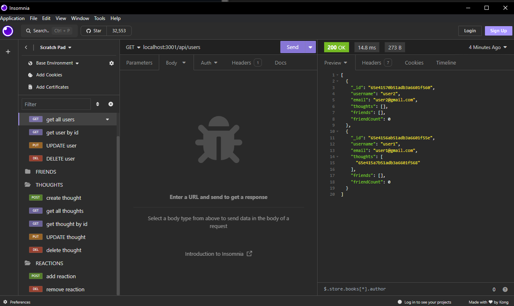

# Social-Network-API

## Description

In this challenge, I created a social network API that i can API POST, PUT, and DELETE routes in Insomnia. I am also able to successfully create, update, and delete users and thoughts in my database and I can successfully create and delete reactions to thoughts and add and remove friends to a user’s friend list.

## Installation

I used visual studio code to create this api as well as insomnia to test it.

## Screenshot

## Credits

N/A

## License 

Please refer to the LICENSE in the repo.
